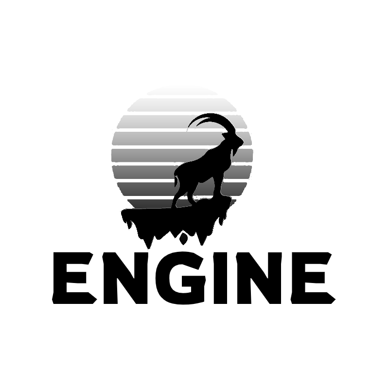
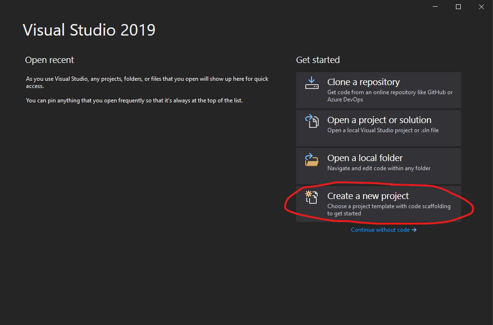
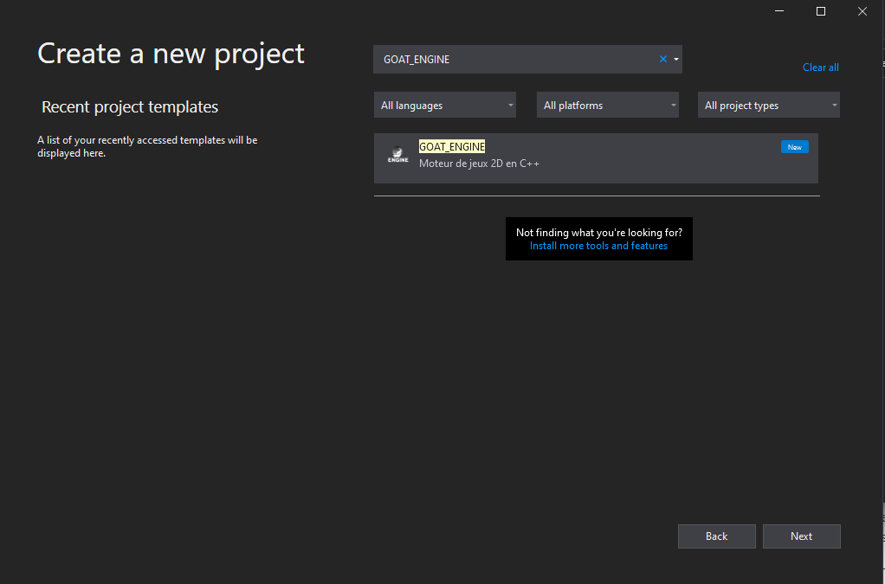

<div id="top"></div>

<!-- PROJECT SHIELDS -->
<!--
*** I'm using markdown "reference style" links for readability.
*** Reference links are enclosed in brackets [ ] instead of parentheses ( ).
*** See the bottom of this document for the declaration of the reference variables
*** for contributors-url, forks-url, etc. This is an optional, concise syntax you may use.
*** https://www.markdownguide.org/basic-syntax/#reference-style-links
-->
[![Contributors][contributors-shield]][contributors-url]
[![Forks][forks-shield]][forks-url]
[![Stargazers][stars-shield]][stars-url]
[![Issues][issues-shield]][issues-url]
[![MIT License][license-shield]][license-url]


<!-- PROJECT LOGO -->
<br />
<div align="center">
  <a href="https://github.com/CGOAT24/GOAT_ENGINE">
    
  </a>

<h3 align="center">GOAT ENGINE</h3>

  <p align="center">
    Bééééhhhhh
    <br />
    <a href="https://github.com/CGOAT24/GOAT_ENGINE/wiki"><strong>Explorer la docs »</strong></a>
    <br />
    <br />
    ·
    <a href="https://github.com/CGOAT24/GOAT_ENGINE/issues">Rapportez une erreur</a>
    ·
    <a href="https://github.com/CGOAT24/GOAT_ENGINE/issues">Demander une fonctionnalité</a>
  </p>
</div>


<!-- TABLE OF CONTENTS -->
<details>
  <summary>Table des matières</summary>
  <ol>
    <li>
      <a href="#à-propos-du-projet">À propos du projet</a>
      <ul>
        <li><a href="#construit-avec">Construit avec</a></li>
      </ul>
    </li>
    <li>
      <a href="#commencer">Commencer</a>
      <ul>
        <li><a href="#préalables">Préalables</a></li>
        <li><a href="#installation">Installation</a></li>
      </ul>
    </li>
    <li><a href="#usage">Usage</a></li>
    <li><a href="#contribution">Contribution</a></li>
    <li><a href="#license">License</a></li>
    <li><a href="#contact">Contact</a></li>
  </ol>
</details>


<!-- ABOUT THE PROJECT -->
## À propos du projet

Utiliser la puissance de OpenGL et du C++ pour créer votre jeux vidéo sans la complexité d'openGl. Goat engine vous fournis une structure simple a utiliser sans sacrifier de la puissance. 

<p align="right">(<a href="#top">retour au début</a>)</p>

### Construit avec

* [GLFW](https://www.glfw.org/)
* [GLAD](https://github.com/Dav1dde/glad)
* [OpenGL](https://www.opengl.org/)
* [OpenGL Mathematics (GLM)](https://github.com/g-truc/glm)
* [STB](https://github.com/nothings/stb)
* [irrKlang](https://www.ambiera.com/irrklang/)

<p align="right">(<a href="#top">retour au début</a>)</p>

## Commencer

This is an example of how you may give instructions on setting up your project locally.
To get a local copy up and running follow these simple example steps.

### Préalables
L'utilisation du GOAT_ENGINE requiert Visual Studio 2019 ou plus récent ainsi que C++17. 

### Installation

1. Télécharger la dernière version de [GOAT_ENGINE](https://github.com/CGOAT24/GOAT_ENGINE/releases)
2. Déplacer le fichier zip à l'endroit suivant:
   ```
   C:/Users/[Votre nom]/Documents/Visual Studio 2019/Templates/ProjectTemplates
   ```
3. Ouvrir Visual Studio et créer un nouveau projet
   
4. Dans la liste des projets, choisir GOAT_ENGINE
   
5. Une fois le projet créé, dans l'explorateur de solution, Faire un clique droit avec la souris sur le projet et appuyer sur `propriétées`
6. Dans `Propriétées de configuration`, appuyer sur `Répertoires VC++`
7. Dans le champ `Répertoires Include`, inclure le chemin suivant:
   ```
   [chemin vers le projet]/Libraries/include
   ```
8. Dans le champ `Répertoire Library`, inclure le chemin suivant:
   ```
   [chemin vers le projet]/Libraries/lib
   ```
9. Ensuite, télécharger le fichier suivant: https://www.ambiera.at/downloads/irrKlang-64bit-1.6.0.zip
10. Une fois téléchargé, naviguer dans le fichier zip à l'endroit suivant: ``bin\winx64-visualStudio\`
11. Copier les trois fichiers .dll vers le build de votre projet. Par défaut, le build se trouve à l'endroit suivant: `[chemin vers le projet]/x64/debug/`
12. Vous êtes prêt à faire votre jeux!

<p align="right">(<a href="#top">retour au début</a>)</p>

<!-- CONTRIBUTING -->
## Contribution

Les contributions sont ce qui fait de la communauté open source un endroit incroyable pour apprendre, inspirer et créer. Toutes les contributions que vous faites sont ** grandement appréciées **.

Si vous avez une suggestion qui améliorerait cela, veuillez fork le dépôt et créer une pull request. Vous pouvez aussi simplement ouvrir un ticket avec le tag "amélioration".
N'oubliez pas de mettre une étoile au projet ! Merci encore!

1. Fork le projet
2. Create your Feature Branch (`git checkout -b feature/AmazingFeature`)
3. Créez votre branche de fonctionnalité (`git commit -m 'Add some AmazingFeature'`)
4. Pousser vers la branche (`git push origin feature/AmazingFeature`)
5. Ouvrer une Pull Request

<p align="right">(<a href="#top">retour au début</a>)</p>


<!-- LICENSE -->
## License

Distribué sous la licence Apache 2.0. Voir `LICENSE.txt` pour plus d'informations.

<p align="right">(<a href="#top">retour au début</a>)</p>


<!-- CONTACT -->
## Contact

Chad Gauthier - chad.gauthier32@gmail.com

Louka Gauthier - [@loukag05](https://twitter.com/loukag05) - loukagauthier55@gmail.com

Lien du projet: [https://github.com/CGOAT24/GOAT_ENGINE/](https://github.com/CGOAT24/GOAT_ENGINE/)

<p align="right">(<a href="#top">retour au début</a>)</p>


<!-- MARKDOWN LINKS & IMAGES -->
<!-- https://www.markdownguide.org/basic-syntax/#reference-style-links -->
[contributors-shield]: https://img.shields.io/github/contributors/CGOAT24/GOAT_ENGINE.svg?style=for-the-badge
[contributors-url]: https://github.com/CGOAT24/GOAT_ENGINE/graphs/contributors
[forks-shield]: https://img.shields.io/github/forks/CGOAT24/GOAT_ENGINE.svg?style=for-the-badge
[forks-url]: https://github.com/CGOAT24/GOAT_ENGINE/network/members
[stars-shield]: https://img.shields.io/github/stars/CGOAT24/GOAT_ENGINE.svg?style=for-the-badge
[stars-url]: https://github.com/CGOAT24/GOAT_ENGINE/stargazers
[issues-shield]: https://img.shields.io/github/issues/CGOAT24/GOAT_ENGINE.svg?style=for-the-badge
[issues-url]: https://github.com/CGOAT24/GOAT_ENGINE/issues
[license-shield]: https://img.shields.io/github/license/CGOAT24/GOAT_ENGINE.svg?style=for-the-badge
[license-url]: https://github.com/CGOAT24/GOAT_ENGINE/blob/master/LICENSE.txt
[linkedin-shield]: https://img.shields.io/badge/-LinkedIn-black.svg?style=for-the-badge&logo=linkedin&colorB=555
[linkedin-url]: https://linkedin.com/in/linkedin_username
[product-screenshot]: images/screenshot.png
